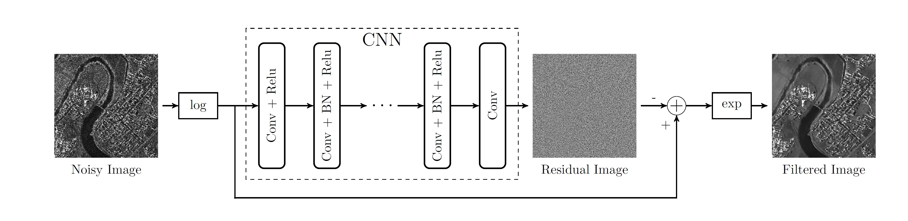

In this paper we investigate the use of discriminative model learning through Convolutional Neural Networks (CNNs) for SAR image despeckling. The network uses a residual learning strategy, hence it does not recover the filtered image, but the speckle component, which is then subtracted from the noisy one. Training is carried out by considering a large multitemporal SAR image and its multilook version, in order to approximate a clean image. Experimental results, both on synthetic and real SAR data, show the method to achieve better performance with respect to state-of-the-art techniques.

### Bibtex

```js
@INPROCEEDINGS{sar_cnn,
author={G. Chierchia and D. Cozzolino and G. Poggi and L. Verdoliva},
booktitle={2017 IEEE International Geoscience and Remote Sensing Symposium (IGARSS)}, 
title={SAR image despeckling through convolutional neural networks}, 
year={2017},
pages={5438-5441}
}
```


